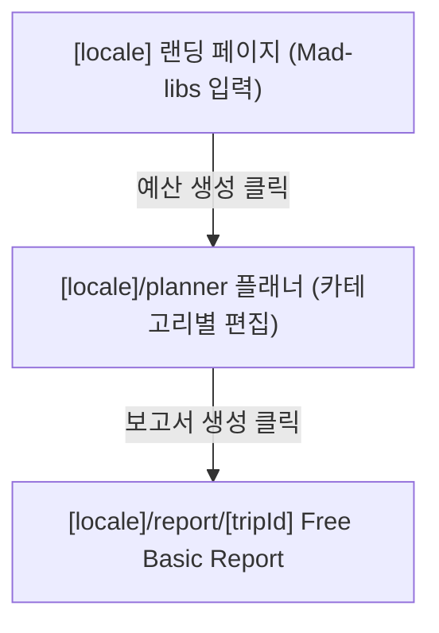

# Target Information Architecture (목표 정보 구조 설계)

HypeHeritage의 Next.js 전환 이후 구현할 다국어 라우트 구조 및 MVP 사용자 저니를 정의합니다. 기존 정적 프로토타입의 순차 마법사(Wizard) 흐름을 그대로 포팅하지 않고, UX 최적화를 위한 카테고리 기반 편집 구조를 지향합니다.

## 1. 목표 라우트 구조 (Target Route Structure)

다국어 지원(i18n) 및 SEO 최적화를 위해 `[locale]` 동적 라우트 세그먼트를 활용합니다.

```
/                       --> Default Locale 리다이렉트 (KO)
/[locale]               --> 랜딩 페이지 (Mad-libs 기반 빠른 입력 지원)
/[locale]/planner       --> 통합 플래너 (예산 편집 및 카테고리 설정)
/[locale]/report/[tripId] --> 생성된 예산 보고서 (Free Basic / Paid One-Stop)
/[locale]/trend         --> 독립 콘텐츠: K-Trend (한국 여행 트렌드 정보)
/[locale]/guide         --> 독립 콘텐츠: K-Guide (한국 여행 준비 가이드)
/[locale]/saved-trips   --> 독립 콘텐츠: 저장된 여행 목록 (로컬스토리지/회원 DB 연동)
```

---

## 2. MVP 핵심 사용자 흐름 (Core MVP Journey)

사용자가 번거로운 가입 없이 예산 보고서까지 도달할 수 있는 가장 빠른 흐름을 구축합니다.



*   **1단계 (Landing)**: 메인 화면의 Mad-libs 문장을 통해 간단한 요건(일수, 인원, 타겟 예산군)을 선택하고 예산안 생성 시작.
*   **2단계 (Planner)**: 카테고리별 예산 바스켓(숙소, 식비, 교통 등)을 한 화면 내에서 유연하게 편집 및 커스텀 식사 추가.
*   **3단계 (Free Basic Report)**: 전체 합계액 및 스마트 영수증, 목표 예산 대비 차액을 확인 가능한 기본 보고서 뷰 제공.

---

## 3. 정보 구조 설계 원칙

1.  **카테고리 기반 통합 편집 (Category-based Editing)**:
    *   기존 프로토타입처럼 숙소 선택 페이지, 식사 지정 페이지 등을 엄격한 **순차 마법사(Wizard) 단계로 강제하지 않습니다.**
    *   `[locale]/planner` 내의 탭 또는 서브 섹션을 통해 사용자가 원하는 순서로 자유롭게 숙박, 식사, 교통 바스켓을 넘나들며 편집할 수 있는 UI 구조를 목표로 합니다.
2.  **K-Trend 필수 단계 배제**:
    *   K-Trend(한국 여행 트렌드)는 사용자에게 가치를 전달하는 독립 콘텐츠일 뿐이며, **예산 보고서를 생성하기 전 반드시 거쳐야 하는 필수 단계가 아닙니다.**
    *   유기적으로 플래너 화면이나 보고서 하단에 트렌드 정보를 제안(Affiliate/Recommendation)하되, 사용자 흐름을 끊지 않도록 격리합니다.
3.  **유료화 비즈니스 흐름 설계 (Monetization)**:
    *   **Free Basic Report (무료 기본 보고서)**: "이 여행에 얼마가 필요한가?"에 대한 종합 정보(스마트 영수증 포함)를 제공.
    *   **Paid One-Stop Report (유료 원스톱 보고서)**: "그 예산으로 무엇을 예약하고 어디를 가야 하는가?"에 대한 실질적인 숙소 추천 리스트, 예약 공식 링크, 제휴 할인, eSIM 구매 정보 등을 포함한 프리미엄 패키지.
